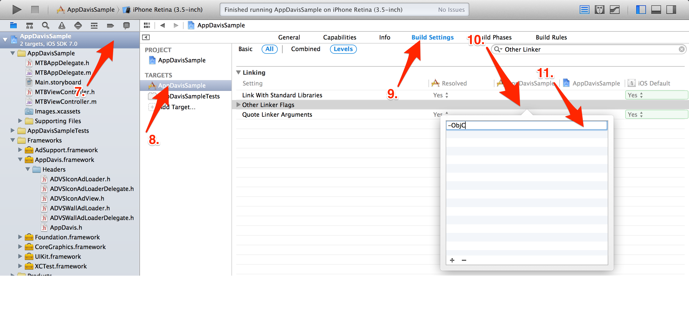

# 目次

* [対応環境](#support)
* [開発環境](#env)
* [IDFAの使用について](#idfa)
* [Hike iOS SDK をダウンロード](#dl)
* [Hike iOS SDK をインストール](#install)
* [エラー文言の表示](#error)
* [CocoaPods の利用](#pods)
* [ウォール広告とアイコン広告について](#wall_icon)

本ドキュメントは Hike iOS SDK (旧 AppDavis iOS SDK) を Xcode のプロジェクトに追加し、実際に使える所までを記したものです。

<a name="support"></a>
#対応環境

動作する **iOS のバージョンは 6.0 以上**になります。

動作確認を行っているデバイスは以下になります。

| デバイス種類 |                    モデル名                     |
|--------------|-------------------------------------------------|
|    iPhone    |             iPhone 5                            |
|     iPad     |              iPad Air                           |
|  iPod Touch  |        iPod Touch 第四世代                      |

上記以外のデバイスでは動作しない可能性があります。

お困りの際は以下のサポートまで一報ください。

[a@mtburn.com](a@mtburn.com)

<a name="env"></a>
#開発環境

サポートする **Xcode のバージョンは 5.0 以上**としています。

<a name="idfa"></a>
#IDFAの使用について

本SDKは広告の成果測定のため IDFA を利用しています。

<a name="dl"></a>
#Hike iOS SDK をダウンロード

以下の URL から Hike iOS SDK をダウンロードします。最新のバージョンを選択することを推奨します。

[Hike iOS SDK をダウンロード](https://github.com/mtburn/MTBurn-iOS-SDK-Install-Guide/releases)

ダウンロードが完了したら、取得した zip ファイルを解凍して sdk ディレクトリ直下に以下の Framework ファイルを確認して下さい。

```
AppDavis.framework
```

また、デモアプリを試す場合は、DemoApp ディレクトリ内のプロジェクトを立ち上げてください。Framework ファイルの追加は以下の該当する項目を確認して下さい。

```
$ cd DemoApp/
$ open DemoApp.xcodeproj/
```

<a name="install"></a>
#Hike iOS SDK をインストール

上記で取得した Framework ファイルをプロジェクトへ追加します。

AppDavis.framework をドラッグ&ドロップで、プロジェクトの Frameworks ディレクトリに入れて下さい。


追加時に出てくるオプション情報入力では以下の様にして下さい。


Frameworks グループに AppDavis.framework が追加された事を確認できたら、以下の順番で追加する AdSupport.Framework を設定します。

- 1.プロジェクトファイルを選択

- 2.ビルドターゲットを選択

- 3.Build Phase タブを選択

- 4.Link Binary with Libraries セクションの + ボタンをクリック


- 5.AdSupport.framework を選択

- 6.Add ボタンをクリック


最後に以下の順番で Other Linker Flag を設定します。

- 7.プロジェクトファイルを選択

- 8.ビルドターゲットを選択

- 9.Build Settings タブを選択

- 10.Other Linker Flags を検索、選択

- 11.-ObjC フラグを追加



これでインストールは完了です。

<a name="error"></a>
#エラー文言の表示

DemoApp/DemoApp/ADVSError.strings を SDK を利用するプロジェクトに加えてください。

<a name="pods"></a>
#CocoaPodsの利用

[CocoaPods](http://cocoapods.org/) を使用した導入も可能です。Podfile に以下のように記入し `pod install` することで SDK がご利用いただけます。

```ruby
pod 'AppDavis-iOS-SDK'
```

また以下のようにバージョンを指定することも可能です。

```ruby
pod 'AppDavis-iOS-SDK', 'X.Y.Z'
```

その際は常に[最新バージョンの SDK](http://cocoapods.org/?q=AppDavis-ios-sdk) をご利用いただくことを推奨します（最新バージョンの反映が 1日程度遅れる場合がありえますのでご了承ください）。

<a name="wall_icon"></a>
#ウォール広告とアイコン広告について

Apple 社の審査基準の変化に伴い、次のアップデートよりウォール広告とアイコン広告の API の削除を予定しております。

すでに実装されている SDK への影響はありませんが、広告案件の減少が予想されます。

`JavaScript SDK` を使ってアイコン広告を実装する選択肢が用意されております。管理画面より広告タグを発行して使うことができます。
