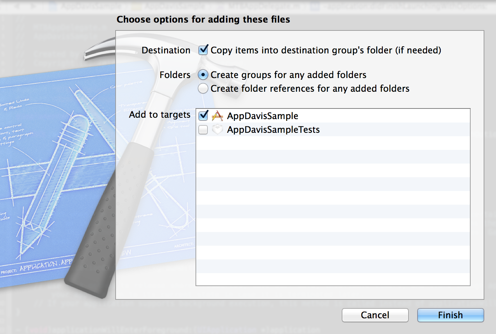

# Table of Contents

* [Supported Environment](#support)
* [Development Environment](#env)
* [About the Use of IDFA](#idfa)
* [Downloading the Hike iOS SDK](#dl)
* [Installing the Hike iOS SDK](#install)
* [Displaying the Error Messages](#error)
* [Use of CocoaPods](#pods)

This document adds the Hike iOS SDK (previously AppDavis iOS SDK) to the Xcode project and describes up to the point of actual use. 

<a name="support"></a>
# Supported Environment
The operating iOS version is **from 6.0 onward**.

Devices on which the operations have been confirmed are as follows.

| Device type |                    Model name                     |
|--------------|-------------------------------------------------|
|    iPhone    |             iPhone 5                            |
|     iPad     |              iPad Air                           |
|  iPod Touch  |        iPod Touch 4th generation                     |


It may not operate on devices other than the ones mentioned above. 

Contact our support team at the following address in case of any issues. 

[a@mtburn.com](a@mtburn.com)

<a name="env"></a>
# Development Environment
The supported Xcode version is **5.0 onward**. 

<a name="idfa"></a>
# About the Use of IDFA
This SDK uses IDFA to evaluate the benefits of an advertisement. 

<a name="dl"></a>
# Downloading the Hike iOS SDK 
Download the Hike iOS SDK from the following URL. We recommend that you select the latest version. 

[Downloading the Hike iOS SDK](https://github.com/mtburn/MTBurn-iOS-SDK-Install-Guide/releases)

When the download is complete, unzip the acquired zip file and confirm the following Framework files directly below the sdk directory. 

```
AppDavis.framework
```

When trying a demo application, open the project within the DemoApp or DemoAppSwift directory. Select the relevant item from the list below when adding Framework files.

```sh
# Demo applications implemented in Objective-C 
$ cd DemoApp/
$ open DemoApp.xcodeproj/

# Demo applications implemented in Swift
$ cd DemoAppSwift/
$ open DemoAppSwift.xcodeproj/
```
<a name="install"></a>
# Installing Hike iOS SDK
Add the Framework files acquired above to the project.

Drag and drop AppDavis.framework and add it to the project Frameworks directory. 


Set the option input information that appears when adding the framework to the following. 



Once it is confirmed that the AppDavis.framework has been added to the Frameworks group, the AdSupport.Framework to be added is set using the following procedure: 

- 1.Select the project file

- 2.Select the build target

- 3.Select the Build Phase tab

- 4.Click the Link Binary with Libraries section + button


- 5.Select AdSupport.framework 

- 6.Click the Add button


Finally, set the Other Linker Flag using the following procedure: 

- 7.Select the project file

- 8.Select the build target

- 9.Select the Build Settings tab

- 10.Search for and select Other Linker Flags 

- 11.Add the ObjC flag


This completes the installation.

<a name="error"></a>
# Displaying the error messages
Add DemoApp/DemoApp/ADVSError.strings to the project using SDK. 

<a name="pods"></a>
# Using CocoaPods
It is also possible to implement this using [CocoaPods](http://cocoapods.org/)  The SDK can be used by specifying it in the Podfile as follows and performing a `pod install`.

```ruby
pod 'AppDavis-iOS-SDK'
```
Further, it is also possible to specify the following versions.

```ruby
pod 'AppDavis-iOS-SDK', 'X.Y.Z'
```

At this time, we recommend using [the most recent version of the SDK] (http://cocoapods.org/?q=AppDavis-ios-sdk) (please be aware that it may take about one day to select the most recent version). 
